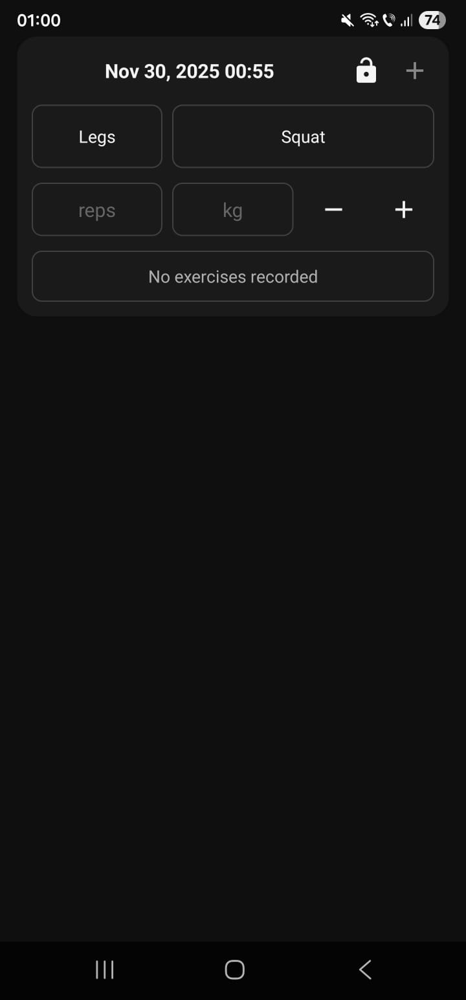
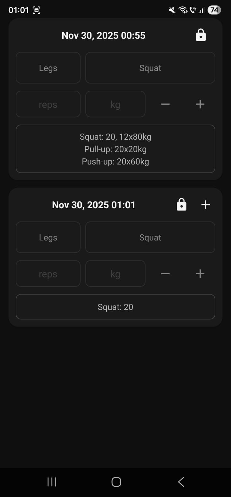

# 💪 Workout Tracker

A clean and intuitive Android workout tracking app built with Kotlin that helps you log and monitor your fitness progress using the proven Legs-Core-Push-Pull training system.

<div align="center">
  <table>
    <tr>
      <td align="center">
        <br/>
        <em>Workout 1</em>
      </td>
      <td align="center">
        <br/>
        <em>Workout 2</em>
      </td>
    </tr>
  </table>
</div>

## ✨ Features

### 🏋️‍♂️ Workout Management
✅ **Multiple Workout Sessions** - Create and manage unlimited workout sessions with automatic timestamps  
✅ **Legs-Core-Push-Pull System** - Organized around the proven LCPP training methodology  
✅ **Workout Locking** - Secure your completed workouts to prevent accidental edits  
✅ **Quick Workout Creation** - Add new workouts with a single tap when current workout has exercises  

### 📊 Exercise Tracking
✅ **Comprehensive Exercise Database** - Pre-loaded with essential exercises for each muscle group  
✅ **Set Management** - Add/remove sets with proper validation  
✅ **Detailed Set Tracking** - Log repetitions and weights for each set  
✅ **Real-time Exercise Display** - See all logged sets organized by exercise  

### 💾 Data & Storage
✅ **Local Data Persistence** - All data stored locally using SharedPreferences  
✅ **Automatic Save** - Workouts automatically saved when modified  
✅ **Data Integrity** - Proper error handling and input validation  

### 🎯 Smart UI/UX
✅ **Automatic Scrolling** - Smart scroll to latest workout when adding new sessions  
✅ **Keyboard-Aware Interface** - Input fields automatically adjust when keyboard appears  
✅ **Material Design** - Clean, modern interface following Android design principles  

## 🚀 Quick Start

### Prerequisites
- Android Studio Flamingo or later
- Android SDK API 21+
- Kotlin 1.8+

### Installation & Setup
```bash
git clone https://github.com/ssbodea/Workout-Tracker.git
cd Workout-Tracker
