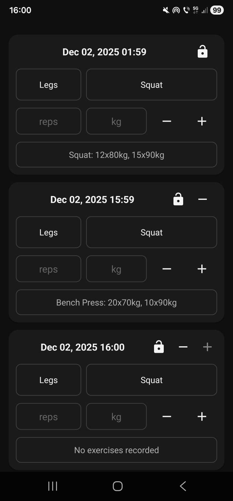

# Workout-Tracker 🏋️‍♂️

Workout-Tracker is an Android app built with **Kotlin** for tracking workouts.  
It allows you to log exercises, sets, repetitions, weights, and monitor your training progress over time.

---

## Features

- Track sessions by workout category
- Add exercises with sets, reps, and weight
- Save and review past workouts
- Clean and simple UI

---

## App Build (APK Included)

A ready-to-run build of the app has been generated and compressed as:

`build.rar`, this file contains the compiled **APK**.  
You can extract it and install the APK on any Android device with app-sideloading enabled.

---

## Screenshot

---

## Prerequisites (to Modify or Build the Project)

To edit, build, or extend the app, you must have the following installed:

- **Android Studio** (latest stable version recommended)
- **Android SDK**  
  - Minimum SDK version matching the project configuration  
- **Android Build Tools**  
- **Java Development Kit (JDK 17 or the version configured in the project)**  
- **Gradle** (handled automatically by Android Studio)
- A physical Android device or an **Android Emulator** for testing

---
